# ChromaPalette: A Versatile Scientific Color Palette Library

Are you tired of spending countless hours searching for the perfect color scheme for your scientific visualizations? Look no further! Introducing **ChromaPalette** - a comprehensive and versatile color palette library tailored for researchers and scientists. With 50 stunning and carefully designed color schemes, creating eye-catching and informative visualizations has never been easier!

## Features
- **50 Unique Color Schemes**: Featuring a diverse range of color schemes, from gradient to low saturation, Morandi-inspired palettes, and vibrant, high contrast options.
- **Time Saving**: Eliminate the need to search the internet for color palettes - ChromaPalette has you covered.
- **Designed for Science**: Crafted specifically for the scientific community, each color scheme is suited for various types of data visualization.
- **Effortless Color Scheme Creation**: Auto-generate custom color schemes with ChromaPalette. Simply choose a scheme and input the number of colors, and ChromaPalette takes care of the rest, seamlessly filling in gaps with gradient colors when needed. The possibilities are endless!
- **Color Code Conversion**: ChromaPalette effortlessly converts between HEX and RGB color codes, allowing you to switch between formats depending on your needs. Create beautiful color schemes with ease and translate them seamlessly with ChromaPalette.


## Color Schemes
1. Coral


2. VanGogh


3. CafeTarrence


4. MintGradient


5. Candies


6. Macarons


7. Matcha


8. Melody
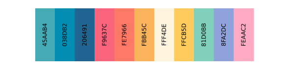

9. Lollipop


10. Sunrise
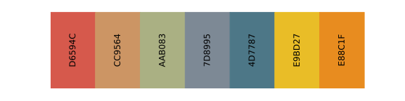

11. Monet


12. Waterlilies


13. Sunflowers


14. Irises


15. WheatFields


16. Serene


17. Elegant


18. Vibrance


19. Radiant
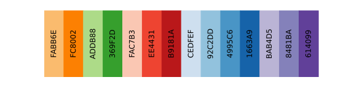

20. RoseGradient
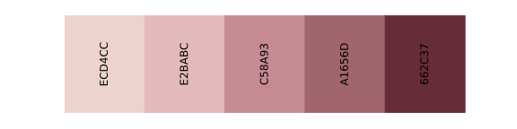

21. PurpleGradient


22. BlueGradient
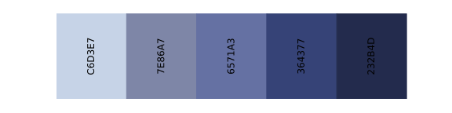

23. Retro
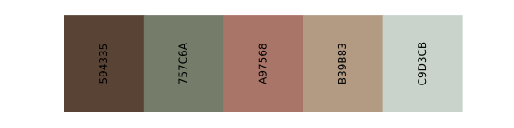

24. HarmonyMix
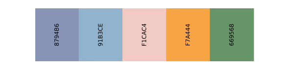

25. SimplePastel
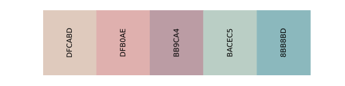

26. SoftVintage
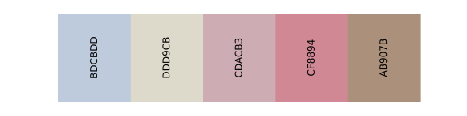

27. EasternHues
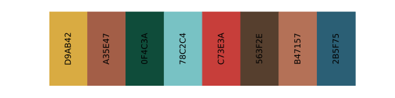

28. RelaxingPastel
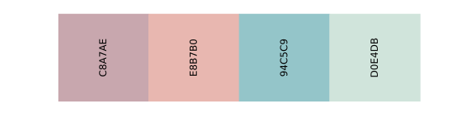

29. Lotus
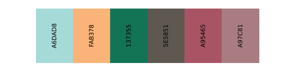

30. CalmBalance
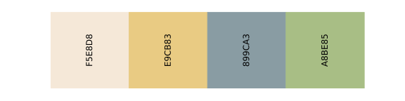

31. Eggplant
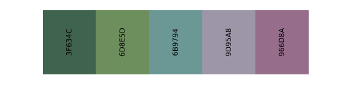

32. SeaSalt


33. Enamel
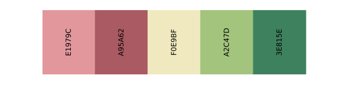

34. Pearwood
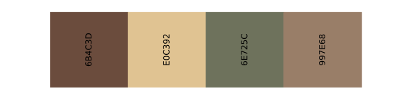

35. VintageBlend
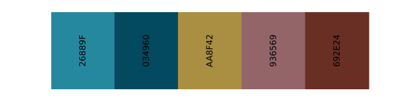

36. CozyBlue
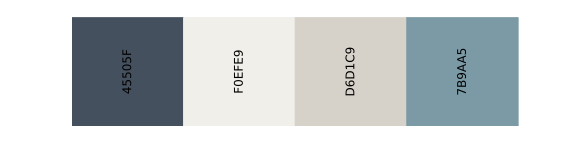

37. OrangeLatte
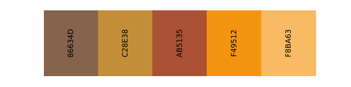

38. WatermelonSoda
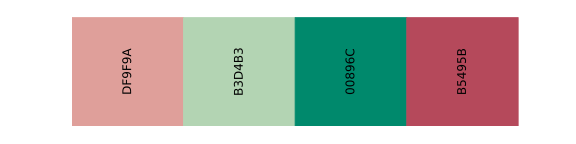

39. SoftSerenity
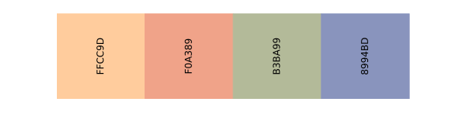

40. Westminster
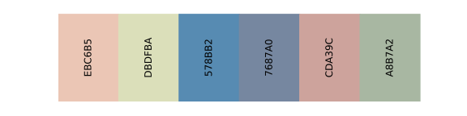

41. EarthyTones
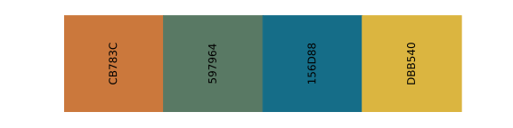

42. GracefulHues
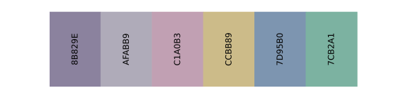

43. Pond
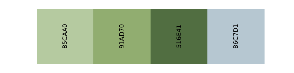

44. MutedBlend
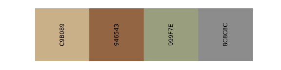

45. FlowerBed
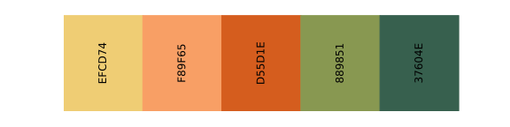

46. Turner
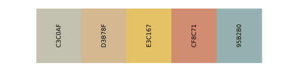

47. WarmHues
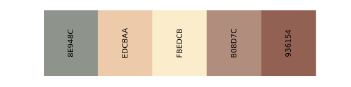

48. ColorBlocking
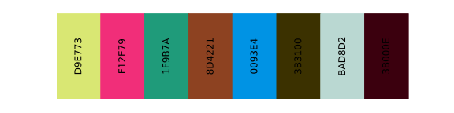

49. Porcelain
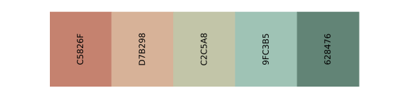

50. RetroComfort


## Get Started
To start using ChromaPalette, simply clone or download the repository from GitHub and import it into your favorite data visualization tool.
```
git clone https://github.com/SabrinaSun1225/ChromaPalette
```

To install the package, please input
```
python setup.py install
```

You may update your PYTHONPATH with
```
export PYTHONPATH="put-your-path-here:$PYTHONPATH"
```

The following code can be used to import ChromaPalette:
```
from ChromaPalette.chroma_palette import *
```

To generate a list of colors from a color scheme, you can use the following code:
```
your_color_list = color_palette(name="Sunrise",N=8)
```
Here, "**N**" is the number of colors and "**name**" is the name of the color scheme.

If you have a HEX code, but you want its RGB code. You can use function "hex_to_rgb":
```
rgb = hex_to_rgb(hex)
```
To convert an RGB code (e.g., rgb=[R, G, B]) to a HEX code, you can use the 'rgb_to_hex' function:
```
hex = rgb_to_hex(rgb)
```

## Colorblind-Friendly Visualizations 

Please use the tool below to check that the color schemes you generate are colorblind-friendly

[https://color.adobe.com/create/color-accessibility](https://color.adobe.com/create/color-accessibility)

**Learn more about colorblind-friendly visualizations**: 

Check out this article from Nature for more information: [https://www.nature.com/articles/d41586-021-02696-z](https://www.nature.com/articles/d41586-021-02696-z)


With ChromaPalette, you can elevate the aesthetics of your visualizations and captivate your audience. Don't wait - try ChromaPalette today and let your data speak for itself!
