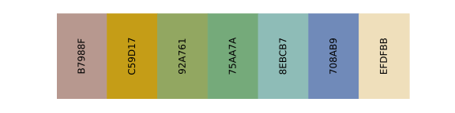
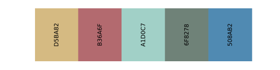

# ChromaPalette: A Versatile Scientific Color Palette Library

Are you tired of spending countless hours searching for the perfect color scheme for your scientific visualizations? Look no further! Introducing **ChromaPalette** - a comprehensive and versatile color palette library tailored for researchers and scientists. With 20 stunning and carefully designed color schemes, creating eye-catching and informative visualizations has never been easier!

## Features
- **19 Unique Color Schemes**: Featuring a diverse range of color schemes, from gradient to low saturation, Morandi-inspired palettes, and vibrant, high contrast options.
- **Time Saving**: Eliminate the need to search the internet for color palettes - ChromaPalette has you covered.
- **Designed for Science**: Crafted specifically for the scientific community, each color scheme is suited for various types of data visualization.

## Color Schemes
1. Coral


2. VanGogh


3. CafeTarrence


4. MintGradient


5. Candies


6. Macarons


7. Matcha


8. Melody


9. Lollipop


10. Sunrise


11. Monet


12. Waterlilies


13. Sunflowers


14. Irises


15. WheatFields


16. Serene


17. Elegant


18. Vibrance


19. Radiant


## Get Started
To start using ChromaPalette, simply clone or download the repository from GitHub and import it into your favorite data visualization tool.
```
git clone https://github.com/SabrinaSun1225/ChromaPalette
```
With ChromaPalette, you can elevate the aesthetics of your visualizations and captivate your audience. Don't wait - try ChromaPalette today and let your data speak for itself!
